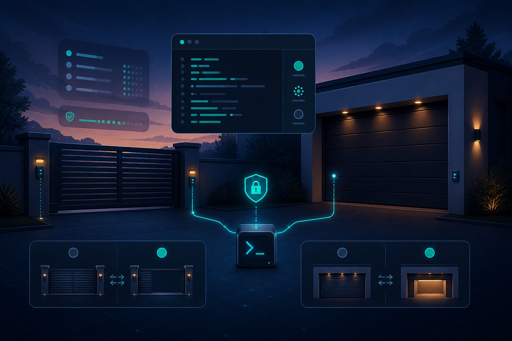

<p align="center">
  
</p>

# gatectl

`gatectl` is a small, dependency-free Python CLI for inspecting and operating
LiftMaster/MyQ residential gates and garage doors. It implements the current
OAuth/PKCE login flow, email or SMS MFA, refreshable sessions, account and
device discovery, state reads, and guarded open/close commands.

> [!WARNING]
> `gatectl` controls physical access equipment through an undocumented MyQ API.
> Keep the opening clear, retain a working official app or wall control, and do
> not use this project for unattended safety-critical automation.

## What it does

- discovers MyQ accounts, hubs, gates, and garage doors;
- reads exact-device state with serials redacted by default;
- stores OAuth tokens and observations outside the repository with mode `0600`;
- opens or closes one exact account/device match;
- refuses offline devices, ambiguous states, unsupported device families, and
  actions MyQ has not marked as safe for unattended operation;
- waits for MyQ to report the requested terminal state.

Python 3.11 or newer is required. There are no runtime package dependencies.

## Install

```bash
git clone https://github.com/cnberry/gatectl.git
cd gatectl
pipx install --editable .
```

If you use [`just`](https://just.systems/), `just install` performs the same
editable `pipx` install. For development without installation, prefix commands
with `PYTHONPATH=src python3 -m gatectl`.

## Configure private targets

Copy the public example to the private runtime location and replace the sample
names with exact values returned by `gatectl inspect`:

```bash
mkdir -p ~/.config/gatectl
install -m 600 config/targets.example.json ~/.config/gatectl/targets.json
```

```json
{
  "account": "Demo Home",
  "devices": ["Driveway Gate", "Garage Door"]
}
```

Use `GATECTL_CONFIG=/path/to/targets.json` or the global
`--config /path/to/targets.json` option to select another file. Real account,
device, host, and deployment data belongs in a private configuration repository,
not in a public fork of `gatectl`.

## Authenticate

Check the current sign-in form, then start one login:

```bash
gatectl doctor
gatectl login --email you@example.com --mfa email
```

The password prompt does not echo. Enter the six-digit email or SMS code when
asked. The password and MFA code are never stored; the resulting refreshable
session is written to `~/.config/gatectl/tokens.json` with mode `0600`.

If MyQ returns a browser-verification challenge, stop and retry later instead
of repeatedly starting new logins. See [authentication](docs/authentication.md)
for the proven flow and recovery guidance.

## Inspect and read state

```bash
gatectl inspect
gatectl status
gatectl status "Garage Door"
```

`inspect` does not require a target config. `status` always scopes matches to
the configured account. Add `--json` for structured output or `--show-serials`
only when a serial is genuinely needed for diagnosis.

## Open and close

```bash
gatectl open "Garage Door"
gatectl close "Garage Door"
```

Interactive commands require typing the requested action. Deliberate
noninteractive callers may pass `--yes`. By default, `open` waits up to 45
seconds and `close` up to 60 seconds for the reported state. Override this with
`--wait SECONDS`; `--wait 0` returns after MyQ accepts the command without
claiming that movement completed.

```bash
gatectl close "Garage Door" --yes --wait 90
```

The successful live validation sequence was `closed → opening → open` followed
by `open → closing → closed`. Closing may remain `open` briefly while the
opener emits its warning signal. See [operations](docs/operations.md) for the
full safety model and state behavior.

## Runtime data

| Data | Default path | Git policy |
| --- | --- | --- |
| Target names | `~/.config/gatectl/targets.json` | Private config repo only |
| OAuth tokens | `~/.config/gatectl/tokens.json` | Never commit |
| Last observation | `~/.local/state/gatectl/last-observation.json` | Never commit |

Passwords and MFA codes are held only for the active login request. Serial
numbers are redacted in normal output and saved observations.

## Reliability and scope

MyQ does not publish or support this residential API. Endpoints, client
metadata, App Check behavior, MFA forms, rate limits, and Cloudflare challenges
can change without notice. `gatectl` intentionally has no toggle or arbitrary
write primitive; its only device writes are the guarded `open` and `close`
endpoints.

See [protocol notes](docs/protocol.md), [troubleshooting](docs/troubleshooting.md),
and the [roadmap](docs/roadmap.md) for more detail.

## Control-tool family

- [`gatectl`](https://github.com/cnberry/gatectl) — MyQ gate and garage-door
  status with guarded open/close.
- [`poolctl`](https://github.com/cnberry/poolctl) — Pentair ScreenLogic status,
  cleaner, and delay control.
- [`hottubctl`](https://github.com/cnberry/hottubctl) — Sundance SmartTub
  temperature and freshness inspection.

All three favor small commands, private local configuration, readable default
output, JSON for automation, guarded writes, and explicit uncertainty.

## Development

```bash
python3 -m venv .venv
.venv/bin/python -m pip install -e ".[dev]"
.venv/bin/ruff format --check src tests
.venv/bin/ruff check src tests
.venv/bin/detect-secrets scan --baseline .secrets.baseline
PYTHONPATH=src .venv/bin/python -m unittest discover -s tests -v
```

Tests use mocked HTTP responses and never contact or operate a real device.

## License and attribution

`gatectl` is released under the [MIT License](LICENSE). The OAuth form parsing,
current client metadata, and endpoint work build on Vadim Belov's MIT-licensed
[`bvdcode/myq-home-assistant`](https://github.com/bvdcode/myq-home-assistant).
See [NOTICE.md](NOTICE.md).
